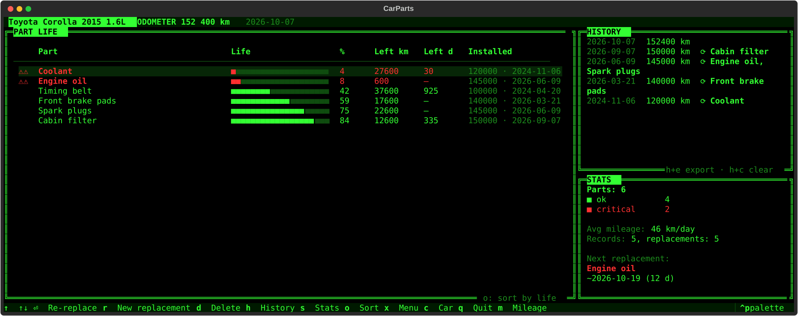

# CarParts TUI

Terminal app for tracking the service life of car parts and consumables, styled after retro terminals 

TUI-приложение для контроля ресурса запчастей и расходников автомобиля. English and Russian UI.



## Features

- You log what was replaced and set the interval: kilometres, days, or both.
  Remaining life is computed per criterion; the one that runs out first wins
  (e.g. coolant is due after a year even with low mileage).
- Yellow / red thresholds per part (40 % / 15 % by default). Critical parts blink
  ⚠⚠ three times every 10 seconds; overdue parts pop up a modal after a mileage entry.
- Up to 5 cars, mileage and replacement history, stats with a forecast of the next replacement.
- Part name autocomplete from a built-in catalogue (~80 common parts, EN/RU).
- Sort parts by remaining life, name or replacement date.
- Export history to Markdown or JSON.
- Follows any Textual theme (`Ctrl+P` → theme); the default is a green phosphor theme.
- Vim keys (`hjkl`), and all hotkeys also work in the Russian keyboard layout.

## Install

### Ready-made binaries (no Python needed)

Download the file for your system from [Releases](https://github.com/dimaogaryov/carparts-tui/releases):

| System | File |
|---|---|
| Windows 10/11 (x64) | `carparts-windows-x86_64.exe` |
| macOS 12 Monterey or newer, Intel | `carparts-macos-intel` |
| macOS 12 Monterey or newer, Apple Silicon (M1…) | `carparts-macos-arm64` |
| Linux x86_64 (glibc 2.35+) | `carparts-linux-x86_64` |

Run it from a terminal:

- **Windows** — double-click or run from Windows Terminal. The binaries are unsigned,
  so SmartScreen may warn: *More info → Run anyway*.
- **macOS** — the binaries are unsigned; allow the first launch once:
  ```sh
  xattr -d com.apple.quarantine ~/Downloads/carparts-macos-intel
  chmod +x ~/Downloads/carparts-macos-intel
  ~/Downloads/carparts-macos-intel
  ```
  Terminal.app shows 256 colours; iTerm2 / WezTerm / Ghostty show the full palette.
- **Linux** — `chmod +x carparts-linux-x86_64 && ./carparts-linux-x86_64`

### From source

Requires Python 3.11+.

```sh
git clone https://github.com/dimaogaryov/carparts-tui.git
cd carparts-tui
python -m venv .venv
.venv/bin/pip install -e .          # Windows: .venv\Scripts\pip install -e .
.venv/bin/carparts                  # Windows: .venv\Scripts\carparts
```

## Keys

| Key | Action |
|---|---|
| `↑↓` / `jk` | move between parts |
| `Enter` | repeat replacement of the selected part (new mileage, same intervals) |
| `r` | new replacement |
| `d` | delete part |
| `m` | quick mileage entry |
| `o` | sort: life → name → replacement date |
| `h` / `s` | toggle history / stats panel |
| `h` then `e` | export history (Markdown / JSON) |
| `h` then `c` | clear history |
| `x` | menu: correct mileage, add/delete car, language… |
| `c` | switch car |
| `Ctrl+P` | command palette (themes) |
| `q` | quit |

In dialogs: `←→` / `hl` switch buttons, `↑↓` move between fields, `Esc` cancels.

## Data

| System | Cars and history, settings |
|---|---|
| Linux | `~/.local/share/carparts/data.json`, `~/.config/carparts/config.json` (XDG) |
| macOS | `~/Library/Application Support/carparts/` |
| Windows | `%APPDATA%\carparts\` |

`XDG_DATA_HOME` / `XDG_CONFIG_HOME`, when set, take priority on every system.

## Development

```sh
.venv/bin/pip install -e '.[dev]'
.venv/bin/pytest
```

Binaries are built by GitHub Actions (`.github/workflows/build.yml`) on Linux, Windows,
macOS Intel and macOS Apple Silicon; every build runs a headless self-test, and macOS
builds are checked to require no newer than macOS 12. Pushing a `v*` tag publishes a release.
Local build: `pip install . pyinstaller && python packaging/build.py`.

## License

[MIT](LICENSE)
